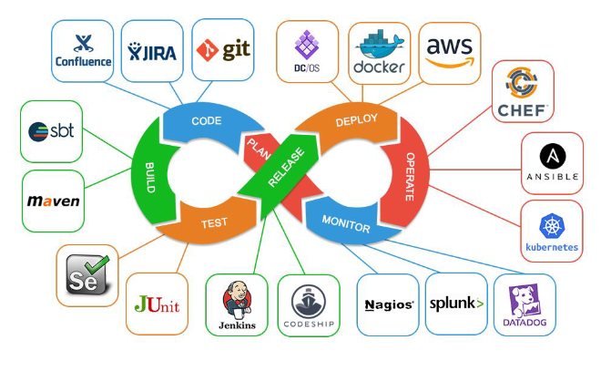

# Devops

<!--foto de portada -->  

## Explicacion y teoria.
1. Introducción.
  [introducción](devops/introduccion.md)
2. ¿Qué es un administrador de sistemas?
   [administrador](devops/asir.md)
3. ¿Qué es un desarrollador?
   [desarrollador](devops/desarrollado.md)
4. ¿Qué es Devops?
   [Devops](devops.md)
